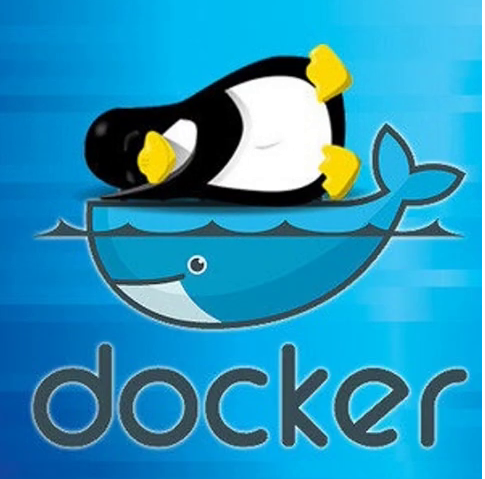
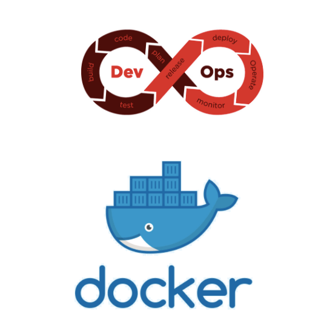

<!--  -->


# **DevOps ve Docker**


---

# Eğitim Konuları - 1

- DevOps Hakkında genel bilgiler
- Docker'a Genel Bakış
- Docker'la Çalışmaya Başlamak
- Container (Makine) ve Kalıp (İmaj) Depolama
- Docker Swarm
- Portainer

---

# Eğitim Konuları - 2

- Linux’a giriş
- Docker Compose
- DockerFile Oluşturma
- İleri Docker Konuları
- Örnek Projeler ve Uygulamalar
  - Nexus
  - Jenkins

URL: https://github.com/ealtintas/presentations

---

# Genel Bilgiler

Bu içerik özellikle docker ve devops konularında çalışmaya yeni başlayan kişilerin daha hızlı uyum sağlamasına yardımcı olmak üzere hazırlanmıştır.

Bu içerikte gördüğünüz güncelleme ihtiyaçlarını ealtintas@gmail.com adresine bildirebilir veya https://github.com/ealtintas/presentations adresinden "merge request" talep edebilirsiniz.

---

# DevOps



---

# DevOps Nedir?

* Development ve Operations kelimelerinin birleştirilmesinden oluşan bir terimdir.
* Dev : “Dev”, genelde yazılım geliştiricileri için kullanılır, ancak gerçekte daha geniş bir topluluğu temsil eder ve “yazılım geliştirme için çalışan herkes”i kapsar.
* Ops : “Ops”, “Dev”e göre daha geniş bir kapsamı olup sistem mühendisleri, sistem yöneticileri, sürüm mühendisleri, veritabanı yöneticileri (DBAs), network mühendisleri, güvenlik uzmanları ve daha birçok değişik alt displinler için kullanılır.
* DevOps metodolijisi sistemi yöneten ve işleten rol ile sistemi geliştiren rol arasındaki mesafeleri azaltmış ve bu iki rolün daha uyum içinde çalışmasının yolunu açarak daha verimli bir geliştirme süreci oluşmasını sağlamıştır.

---

# DevOPS = Otomasyona Dayalı CI/CD

CI/CD: Continuous integration and continuous delivery

---

## DevOps Süreci

* Yazılımcı, kodunu yazdığında, yazılım tek tuş ile derlenir ve sunucuda çalışır hale gelir. (Sürüm Takibi - Version Control)
* Üzerindeki testler otomatik olarak çalışır. Derleme veya testlerde problem varsa, anında rapor edilir.
* Yazılım, istenen periyodlarda, beta ortamına aktarılır ve kullanıcılar tarafından testlerinin yapılması sağlanır. Sonraki adımda, üretim sistemlerine yayılır.
* Üretimde son yayınlamadan ötürü hata çıkarsa, otomasyon sayesinde DevOps anında geri alınmasını sağlayabilir.
* Sistem izleme sayesinde, sistem logları, hatalar ve kaynak kullanımları monitor edilir. Loglarda çıkan hatalar ya yerinde müdahaleyle çözülür, ya da yazılımcılara rapor edilir.
* Zaman içinde ortaya çıkan güvenlik yamaları tüm sistemlere uygulanır

---

# DevOps Kavramları
    
* Çevik Yazılım Geliştirme (Agile Software Development)
* Sürekli İzleme (Continuous Monitoring)
* Yapılandırma Yönetimi (Configuration Management)
* Kod olarak Altyapı (Infrastructure as Code)

---

# DevOps Bir Pozisyon Mudur?

* DevOps tek bir role sığdırılabilecek bir kavram değildir.
* Uygulama yaşam döngüsündeki fazlara dahil olan herkes DevOps kültürünü sahiplenmelidir.
* Ancak DevOps yaklaşımını benimsemiş kurumlarda sadece bu konuya odaklanan kişiler de vardır.
* Bu roldeki kişilerin pozisyonları DevOps Mühendisi ya da DevOps Uzmanı olarak geçer.

---

# DevOps’un Avantajları

* Hız : mikroservis mimarisi, sürekli teslim, servis sahiplenme, hızlı güncelleme, hızlı geliştirme, müşteri ihtiyaçlarına hızlı yanıt verme
* Otomasyon ve Güvenilirlik : Kaliteden emin olarak hızlı ve güvenilir şekilde teslim, otomasyon ve tutarlılık ile karmaşık ve dinamik sistemleri verimli bir şekilde ve daha az riskle yönetme
* Basit ölçekleme :  tutarlılık, tekrarlanabilirlik ve verimlilik...

---

## Referanslar:

- https://www.atlassian.com/devops
- https://github.com/sudo-bmitch/presentations
- https://github.com/faheem556/tysons-code-coffee-docker-fundamentals
- https://safaburakbahceci29.medium.com/ikisi-bir-arada-devops-e50fe2a5e423
- https://teckangaroo.com/docker-devops/

---

# Docker

* Docker temelde deniz taşımacılığında kullanılan konteynerları model alıyor. Konteynerlar keşfedilene kadar her ürün farklı ve verimsiz bir biçimde taşınırken konteynerlar sonrası deniz taşımacılığı standart bir hal almış ve neredeyse tüm ürünler konteyner ile taşınıyor.

---

# GENEL ÖZELLİKLER

* Docker geliştiriciler ve sistem yöneticileri için, yapılandırma, inşa etme ve dağıtım için açık kaynak uygulama oluşturma platformudur.
* Docker Engine, taşınabilir, hafif çalışma zamanı ve paketleme aracı gibi özellikleri ile açık kaynak sahasında kullanılabilirliği en uygun platformlardandır.
* Docker Hub platformu ise paylaşım uygulamaları ve iş akışları otomasyonu için bir bulut hizmetidir.
* Docker, uygulamaların bağımlılıkları ve ihtiyaç duyulan eklentileri ile birleşmesini hızlıca sağlarken, geliştirme ve canlı ortam değişkenleri kaynaklı uyumsuzlukları ortadan kaldırır veya azaltır.

---

* Sonuç olarak, bilişim teknolojileri nakil işlemlerini hızlandırıp aynı uygulamanın değişmeden dizüstü sistemlerinde, veri merkezlerinde ve bulut verilerinde çalışmasını sağlar.
* Docker ile, geliştiriciler herhangi bir uygulamayı, herhangi bir programlama diliyle ve herhangi bir araçla geliştirebilir.
* Docker ile yapılan uygulamalar tamamiyle taşınabilir olup, herhangi bir yerde çalıştırılabilir.

---

# SANALLAŞTIRMA 

* Sanallaştırma işletim sistemleri, depolama aygıtları ya da ağ kaynaklarından herhangi birinin aslını kurmak yerine onları sanal olarak kurmaktır. 
* İşletim sisteminde sanallaştırma, yazılım teknolojilerinin tek bir sistemde (sunucusu); aynı anda birden fazla işletim sistemi çalıştırabilmek için kullanmasıdır.
* 2005 yılına gelindiğinde sanallaştırma teknolojisi sağladığı kolaylıklar ile hızlı ve yaygın bir biçimde benimsendi.
* Sunucu sanallaştırma sayesinde artık tek bir fiziksel sunucu üzerinde onlarca, her biri diğerinden farklı olabilen işletim sistemlerine sahip, sanal makineler çalıştırılabilmektedir.

---

# Docker == Uygulama Sanallaştırma (?)

* Docker Linux tabanlı bir sanallaştırma teknolojisi olarak görülebilir ama aslında tam olarak bir sanallaştırma teknolojisi olmadığı da söylenebilir.
* Esas olan şudur: docker bir sunucu sanallaştırma teknolojisi değildir.
* Diğer taraftan bakınca uygulama denilen kavramın zaten doğduğu günden beri aslında sanal bir kavram olduğu da söylenebilir. Docker'ın bir uygulama paketleme teknolojisi olduğunu söylemek daha doğru olur. 
* Bununla birlikte docker paketlenmiş bu uygulamların paketlenmiş olarak muhafaza edilmeleri dışında, sağlıklı ve etkin şekilde çalıştırılmasına ve hatta uygulamaların birden çok sunucuda dağıtık ve yük dengelemeli (docker swarm) çalıştırılmasına yönelik çözümler de içermektedir.

---

# Docker == Uygulama Sanallaştırma (?)

* Sonuç olarka docker birçok başarılı teknolojiyi uygun şekilde bir araya getirerek, uygulamaları çok geniş bir platform setinde (pratikte hepsi) çalıştırmayı sağlıyor.
* Docker yerleşik linux teknolojilerinden lxc konteynerları, cgroups, aufs, copy-onwrite dosya sistemleri ve daha birçoğunu kullanıyor ve verimliliiğinin temelini bu teknolojileri farklı bir paradigma altında başarıyla bir araya getirmiş olmasından alıyor.
* Bence bu kadar başarılı olmasının hızlıca kabul görmesinin nedenleri arasında o zamana kadar sadece linux uzmanları arasında kabul görmüş bu başarılı teknolojileri uzman olmayanların da kullanabileceği bir biçimde sunmuş olması yatmaktadır.

---

# Docker'ın Genel Yapısı

Docker temelinde 2 teknolojiyi kullanır:
 * LXC (Linux containers)
 * AUFS (Advanced multi layered unification filesystem).

---

# Docker Bileşenleri:

* Docker servisi: Sadece konteynerlerin ayarlarını yapar, çalışma zamanı verilerini toplar. Sanallaştırma yazılımı değildir. Restful bir API ye sahiptir.
* Docker istemcisi: Aynı makinede, ya da farklı bir makinede çalışan, Docker servisine Restful API ile bağlanarak sistemi yönetir. Sağladığı kaynaklar kullanılabilir, ya da özel bir kaynak kurulabilir. 
* Docker Registry(Kaynağı): Docker imajlarının depolandığı, push-pull işlemlerinin yapıldığı depodur.
* Docker Konteyner: Bir docker imajı üzerinde yaratılan bir dizi komutun sistemdeki diğer tüm servislerden izole çalıştığı, "sanal" ortamdır. Sanal bir sunucu gibi düşünülebilir (ama aslında tam olarak değildir).

---

# Docker Bileşenleri:

* Docker imajları: Üzerine yazılımların yüklendiği, istenilen yapıda oluşturulabilen, sistem imajlarıdır.Bir konteyner işletim sistemi, kullanıcı tarafından eklenen dosyalardan ve metadatalar dan meydana gelmektedir. Her bir konteyner bir imajdan inşa edilmektedir. Bu imajlar konteynerların ne tuttuğunu Docker'a anlatır. Docker imajı sadece okunurdur. Docker'da bir imajdan bir konteyner çalıştırıldığı zaman ona okuma yazma izinleri verilir.
* Her bir image katmanlar serisinden oluşmaktadır. Docker bir tek imaj içindeki bu katmanlar kombinasyonu için union file system'ı kullanır. Bir docker imajında değişiklik yapılacağı zaman örneğin bir uygulamanın yeni versiyonu güncellecek ise yeni bir katmana inşa eder.

---

## Referanslar:

- DOCKER İLE UYGULAMA SANALLAŞTIRMA, Sinem Akkoyun (https://issuu.com/sinemakkoyun)
- https://github.com/veggiemonk/awesome-docker
- https://www.youtube.com/watch?v=3c-iBn73dDE - Docker Tutorial for Beginners
- https://www.activestate.com/blog/developing-in-containers-vs-your-day-to-day-machine/
- https://increment.com/development/an-introduction-to-local-development-with-containers/

---

# Linux

* Günümüzde bulut bilişim odaklı projelerde Linux işletim sistemi kullanmasının büyük kolaylık ve verimlilik sağladığı tecrübe ile sabittir.

* Linux dağıtımları konusunda hali hazırda bir tercihi olmayan ya da Linux kullanmaya yeni başlayacak kişilere Türkiyede daha yaygın olmaları itibariyle Türkçe destek konusunda daha az sorun çekeceklerini düşündüğümden kişisel olarak DEB paket yönetim sistemini kullanan Pardus/Debian/Ubuntu ya da bunların türevlerinden bir işletim sistemi seçmelerini önerebilirim.

* İleride Docker bağlamında Linux konusunda ihityaç duyabileceğiniz desteği de vermeye hazırım.

---

# Linux: Terminal / Konsol / Komut satırı

## Linux: Neden?

* GUI araçları bazı durumlarda hız ve pratiklik sağlayabilmektedirler ancak Linux kullanan bir geliştiricinin GUI araçlarına tamamen bağımlı olması kendisini büyük ölçüde kısıtlar.
* Bazı durumlarda GUI'ler kararsız çalışmakta veya bazı hataları göstermeyebilmektedir. 
* GUI araçlarının çeşitliliği ve kullanımı dağıtımdan dağıtıma farklılık gösterebilmektedir.
* Sunuculara GUI araçları kurulması performans ve verimlilik açısından tercih edilen bir yöntem değildir.
* Komut satırı araçları GUI'lere göre daha tutarlı çalışmakta ve bu şekilde yapılan işlemler sunucularda da tutarlı ve otomatize olarak tekrarlanbilmektedir.

---

## Linux: Neden?

* Bazı GUI araçları (postman, firefox, chrome, arandr, gparted, winff) komut satırının avantajlarını da kaybetmemek için GUI'den yapılan işlemlerin muadillerinin kopyla-yapıştır ya da betik dosyasına dışarı aktarma gibi yöntemlerle komut olarak almanıza veya görmenize imkan vermektedir.
* Kullandığımız sunuculardaki tüm container imajları Linux temellidir. Bu container'larda inceleme/debug ihtiyacı olduğunda komut satırı araçlarını bilmek faydalı olmaktadır.
* Bu nedenle geliştiriciler için temel seviyede de olsa Linux komut satırı araçlarını kullanabilmek önemli bir artı sağlar.

---

## Linux: Ne kadar?

- Linux kullanmaya yeni başlayan birisi için öncelikli olarak aşağıdaki komut satırı araçlarının öğrenilmesi önerilebilir:

```
man, ls, cat, less/more, cp/mv, pwd/cd/mkdir/rmdir, grep, time, curl, apt, nano, mc
```

- Temel pek çok geliştirici aracı da en kapsamlı şekilde komut satırından kullanılabilir: 

```
python, pip/pip3, venv, diff, patch, git
```

## Referanslar:
- https://belge.pardus.org.tr/display/PYMBB/GENEL+LINUX+KOMUTLARI+VE+KULLANIMLARI
- https://www.pardus.org.tr/belgeler/#temel-seviye

---
## Linux: Ne? Nerede?

* Linux'ta herşeyin (genel anlamda) bir dosya olarak işlem gördüğü söylenebilir. Bu nedenle temel dosya işlemlerine hakim olmak linux'a hakim olmayı kolaylaştırır.

* Genel olarak linux dosya sistemi yapısı: http://www.belgeler.org/sag/sag_dir-tree-overview_rootfs.html

* Açıkça görmek çok kolay olmasa da, Linux ve etrafında oluşan özgür/açık kaynak kodlu yazılım ekosistemi ile birlikte bilişim teknolojilerinde pek çok çığır açmıştır.

---
## Linux: Nereye kadar?

- Debug için kullanılabilecek komut/araçlar:

```
ps fax, top/htop(bashtop), iotop, iftop, free, hostname, kill, killall/pkill
```

- Kendisin linux komut satırı araçlarında daha da geliştirmek isteyenler aşağıdaki komut/notasyonlarla devam edebilirler:

```
| (pipe), >, >>, tee, tail/head, sort/uniq, cut, awk, wc, xargs, watch, 
sed, vi, tar, chmod, md5sum/sha256sum, find, env, iconv, tee, paste, join
```

## Referanslar:

- http://www.belgeler.org/man/man1/man1.html
- https://www.pardus.org.tr/belgeler/#ileri-seviye

---

# VirtualBox

* https://www.virtualbox.org/

---

# Docker'la Çalışmaya Başlamak
- Docker Dosyası
- Docker Kurulumu
- Docker Hub
- Çevresel Değişkenler
- Docker Volumes
- Değerlendirme

---

# Container (Makine) ve Kalıp (İmaj) Depolama
- Docker Hub
- Docker Hub Girişimi
- Docker Kaydı (Registry)
- Değerlendirme

---

# Container Yönetme
- Docker Komutları
- Docker Swarm

---

# Docker ve Güvenlik
- Containers vs VMs
- Docker Komutları
- Docker Güvenlik Teknikleri
- Docker Güvenlik Uygulaması

---

# Docker Compose
- Docker Compose Kurulumu
- Docker YAML Dosyası
- Docker Compose Kullanımı
- Docker Compose Komutları
- Docker Compose Örnekleri

---

# Docker Swarm
- Docker Swarm Kurulumu
- Docker-Machine Kullanımı & Komutları
- Docker Swarm Bileşenleri
- Docker Swarm Kullanımı
- Docker Swarm Komutları
- Swarm Küme Örneği

---

# DockerFile Oluşturma
- DockerFile Oluşturmaya Nerden Başlamalı?
- Host Yönetimi
- Container Yönetimi
- Docker Compose Kullanımı
- Harici Platform(lar)a Uzatma
- Tüm Güvenlik Konuları
- Docker Kullanıcı Arayüzü
- Kalıp (İmaj) Katmanları
- Değerlendirmeler

---

# docker build

```
<html lang="en">
<head><title>Dockerfile</title></head>
<body><h2>Merhaba Nginx!!!</h2></body>
</html>
```

```
FROM nginx:latest
COPY ./index.html /usr/share/nginx/html/index.html
```

ref: https://www.docker.com/blog/how-to-use-the-official-nginx-docker-image/

---

## Notlar:

.dockerignore docker build işlemine dahil edilmesi istenmeyen dosyaların listesi yazıllır.

---

# Portainer
- Portainer Kurulumu
- Örnekler
- Değerlendirmeler
- Kontrol Paneli
- Nodes Sekmesi
- Nodes'a Dönüş
- Hizmetler Sekmesi
- Repostories Sekmesi
- Stacks

---


# Git

Git bir komutu satırı aracı olarak görülebileceği gibi çeşitli GUI'ler aracılığı ile de kullanılabilir. Git sadece bir yazılım geliştirici aracı olarak görülmemelidir. Metin dosyaları ile çalışan birisi için git harika olanaklar sunmaktadır. Git etrafındaki ekosistemi ile birlikte artık ciddi bir teknoloji haline gelmiştir.

---

## Git: .gitignore dosyası

.gitignore dosyasına uzak git deposuna gönderilmesi istenmeyen dosyaların listesi yazılır.

Örnekler:

- https://github.com/github/gitignore/blob/master/Python.gitignore

---

# İleri Docker Konuları
- Docker Ölçeklendirme
- Keşif Servislerini Kullanma
- Yaygın Problemler ve Çözümleri
- Çeşitli Docker API'leri
- Cotainer'lari Kontrol
- Docker'a Katkıda Bulunmak
- Gelişmiş Docker Ağı

---

# Docker: Yerel geliştirme

Yerelde geliştirilen kodun yerelde de docker içinde test edilmesi sunucuya atıldığında sorun çıkma ihtimalini oldukça düşürecektir. Sunucuda çalışan koddaki problemleri yerelde analiz ederkende analizin docker içerisinden yapılması sunucudaki problemi yerelde başarılı bir şekilde tekrarlama olasılığını önemli oranda artıracaktır.

Projeleri yerelde docker içerisinde kolay bir şekilde test etmek için hazırlanan betik aşağıdaki adrestedir:
- https://dev.teleskop.app/devops/devops/-/blob/test/home/developer/scripts/LocalDocker.sh

---

# Örnek Projeler ve Uygulamalar
- Örnek Docker Projesi Hazırlamak
- GitLab ve 
- Nexus
- Jenkins
- Soru Cevap
- Genel Değerlendirme


---

# Pratik Docker Uygulamaları

- https://ergin.altintas.org 
  - Docker & Nginx & Drupal
  - Docker & Nginx & WordPress
- https://github.com/bboysoulcn/awesome-dockercompose
- docker-compose Elasticsearch & Kibana
  - https://github.com/maxyermayank/docker-compose-elasticsearch-kibana
- GrayLog
  - https://mfyz.com/quick-and-dirty-set-up-graylog-in-5-minutes-with-docker
  - https://docs.graylog.org/en/4.0/pages/installation/docker.html

---

# GitLab & Jenkins & Nexus

---

# Soru Cevap & Genel Değerlendirme

---

Teşekkürler